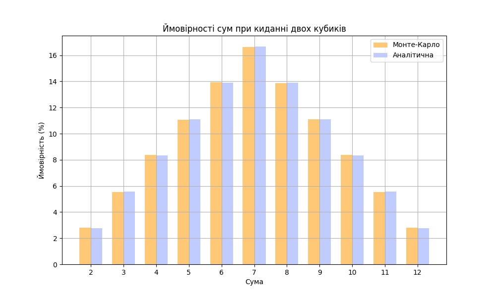

# Симуляція кидків кубиків методом Монте-Карло

## Опис

Програма імітує 1,000,000 кидків двох шестигранних кубиків та обчислює ймовірності кожної можливої суми (від 2 до 12).

## Результати

| Сума | Монте-Карло | Аналітична | Різниця |
|:----:|:-----------:|:----------:|:-------:|
| 2    | 2.78%       | 2.78%      | -0.00%  |
| 3    | 5.56%       | 5.56%      | +0.00%  |
| 4    | 8.33%       | 8.33%      | -0.01%  |
| 5    | 11.17%      | 11.11%     | +0.06%  |
| 6    | 13.93%      | 13.89%     | +0.04%  |
| 7    | 16.63%      | 16.67%     | -0.03%  |
| 8    | 13.84%      | 13.89%     | -0.05%  |
| 9    | 11.11%      | 11.11%     | +0.00%  |
| 10   | 8.33%       | 8.33%      | +0.00%  |
| 11   | 5.55%       | 5.56%      | -0.00%  |
| 12   | 2.77%       | 2.78%      | -0.01%  |

## Графік



## Висновки

1. **Збіжність**: При 1 млн ітерацій симульовані ймовірності відрізняються від аналітичних менше ніж на 0.1%.

2. **Розподіл**: Результати підтверджують трикутний розподіл сум — максимальна ймовірність (16.67%) у суми 7, мінімальна (2.78%) у крайніх значень 2 та 12.

3. **Метод Монте-Карло**: Демонструє ефективність для оцінки ймовірностей випадкових процесів. Точність зростає зі збільшенням кількості ітерацій.

## Запуск

```bash
python main.py
```

